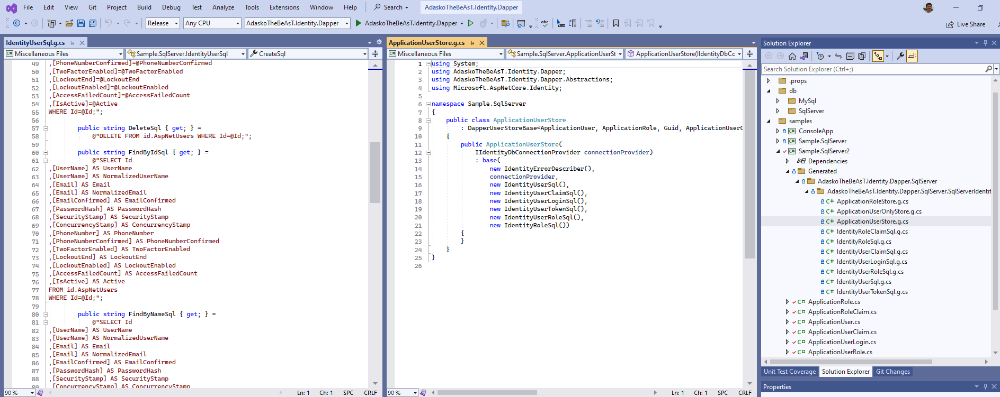

# AdaskoTheBeAsT.Identity.Dapper

Custom Dapper implementation for Microsoft.Extensions.Identity.Stores using Source Code Generators.
[https://learn.microsoft.com/en-us/aspnet/core/security/authentication/identity-custom-storage-providers?view=aspnetcore-7.0](https://learn.microsoft.com/en-us/aspnet/core/security/authentication/identity-custom-storage-providers?view=aspnetcore-7.0).

## Usage

1. In your project add nuget packages

```xml
  <ItemGroup>
    <PackageReference Include="AdaskoTheBeAsT.Identity.Dapper" Version="1.0.0" />
    <PackageReference Include="AdaskoTheBeAsT.Identity.Dapper.SqlServer" Version="1.0.0" />
    <PackageReference Include="Dapper" Version="2.0.123" />
    <PackageReference Include="Dapper.SqlBuilder" Version="2.0.78" />
    <PackageReference Include="Microsoft.Extensions.Identity.Stores" Version="7.0.5" />
  </ItemGroup>
```

1. Add following property groups to your project file

```xml
  <PropertyGroup>
    <!--to see generated code set to true-->
    <EmitCompilerGeneratedFiles>true</EmitCompilerGeneratedFiles>
    <!--override path of generated output-->
    <CompilerGeneratedFilesOutputPath>Generated</CompilerGeneratedFilesOutputPath>
    <AdaskoTheBeAsTIdentityDapper_DbSchema>id</AdaskoTheBeAsTIdentityDapper_DbSchema>
    <AdaskoTheBeAsTIdentityDapper_SkipNormalized>true</AdaskoTheBeAsTIdentityDapper_SkipNormalized>
  </PropertyGroup>
```

1. Add following item groups

```xml
  <ItemGroup>
    <!-- Exclude the output of source generators from the compilation -->
    <Compile Remove="$(CompilerGeneratedFilesOutputPath)/**/*.cs" />
  </ItemGroup>

  <ItemGroup>
    <None Include="Generated/**/*" />
  </ItemGroup>
```

1. To your project add following classes which inherits from Microsoft Identity classes

```csharp
using Microsoft.AspNetCore.Identity;

namespace Sample.SqlServer;

public class ApplicationRole
    : IdentityRole<Guid>
{
}

public class ApplicationRoleClaim
    : IdentityRoleClaim<Guid>
{
}

public class ApplicationUser
    : IdentityUser<Guid>
{
    [Column("IsActive")]
    public bool Active { get; set; }
}

public class ApplicationUserClaim
    : IdentityUserClaim<Guid>
{
}

public class ApplicationUserLogin
    : IdentityUserLogin<Guid>
{
}

public class ApplicationUserRole
    : IdentityUserRole<Guid>
{
}

public class ApplicationUserToken
    : IdentityUserToken<Guid>
{
}
```

1. Recompile your project

1. You should see generated files in Generated folder
